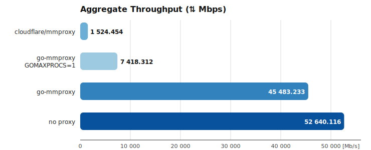

# go-mmproxy

[](https://github.com/kzemek/go-mmproxy/actions/workflows/test.yml)
[](https://github.com/kzemek/go-mmproxy/releases/latest)
[](https://packages.debian.org/sid/go-mmproxy)
[](https://github.com/kzemek/go-mmproxy/blob/master/LICENSE)

`go-mmproxy` is a standalone proxy that unwraps the [HAProxy PROXY protocol](http://www.haproxy.org/download/1.8/doc/proxy-protocol.txt).
It forwards connections to a local server and spoofs the source, so that the backend sees the original client IP address and source port instead of the proxy's.


`go-mmproxy` started as a Go reimplementation of [cloudflare/mmproxy](https://github.com/cloudflare/mmproxy) with a focus on runtime stability and high throughput. 
For background on the approach, see Cloudflare's write-up: [mmproxy - Creative Linux routing to preserve client IP addresses in L7 proxies](https://blog.cloudflare.com/mmproxy-creative-way-of-preserving-client-ips-in-spectrum/).

## Installation

```shell
go install github.com/kzemek/go-mmproxy@latest
```

You'll need at least `go 1.21`.

## Requirements

`go-mmproxy` has to be run:

- on Linux 2.6.28+
- on the same server as the backend service, as the communication happens over the loopback interface<sup>1</sup>;
- as root, or with `CAP_NET_ADMIN` capability, to be able to set `IP_TRANSPARENT` socket opt.

<sup>1</sup> This is not a hard requirement: with the `-mark` option and some iptables magic, `go-mmproxy` can be run on a different host than the backend.
See the [`examples/docker` directory](examples/docker) for a working example.

## Usage

### Basic routing setup

Since the backend service sees the original, external client IP addresses, its response packets would by default be routed to an external network interface.

To make sure they arrive back at `go-mmproxy` instead, we need to set up a couple additional routing rules:

```shell
# Set up a routing table that only routes to loopback
ip route add local 0.0.0.0/0 dev lo table 123
ip -6 route add local ::/0 dev lo table 123

# Route all loopback-originated traffic to the new table
ip rule add from 127.0.0.1/8 iif lo table 123
ip -6 rule add from ::1/128 iif lo table 123

# Listen for PROXY protocol connections on port 25577 and unwrap them
# to local port 25578. Run as root or grant CAP_NET_ADMIN.
go-mmproxy -l 0.0.0.0:25577 -4 127.0.0.1:25578 -6 [::1]:25578
```

#### Validate the setup

In one terminal, start a simple TCP listener that represents your backend:

```shell
nc -kvnl 127.0.0.1 25578
```

In another terminal, send a minimal PROXY v1 header followed by a payload to `go-mmproxy`:

```shell
printf 'PROXY TCP4 127.0.0.1 127.0.0.1 65432 25578\r\nPING\r\n' | nc -vn 127.0.0.1 25577
```

You should see a connection from `127.0.0.1:65432` and a `PING` message arrive in the backend terminal.

> [!IMPORTANT]
> <details>
> <summary>Routing UDP packets</summary>
> &nbsp;
>
> Because UDP is connectionless, if the backend service is bound to `0.0.0.0`, Linux will look up the best source IP address for each response packet.
> The found address will most likely _not_ be in `127.0.0.1/8` range, and won't match the routing rules we set up above.
>
>
> The simplest fix is to bind the backend service's listeners to a loopback address (`127.0.0.1` or `::1` for IPv6).
> This is generally recommended for services behind `go-mmproxy`.
> </details>

### Routing multiple ports

`go-mmproxy` can be set up to listen on multiple ports - even all ports of the machine - using Linux [Transparent proxy support (TPROXY)](https://www.kernel.org/doc/html/latest/networking/tproxy.html).
To use `go-mmproxy` with TPROXY, it MUST be started with `-listen-transparent` flag.

For example, to set up `go-mmproxy` for a port range `10000-20000`:

```shell
# Set up a "local lookup" routing table 123 as in Routing setup above
ip rule add from 127.0.0.1/8 iif lo table 123
ip route add local 0.0.0.0/0 dev lo table 123

# Redirect any new packets coming in on ports 10000-20000 to go-mmproxy's listen
# port and mark them with 1
iptables -t mangle -A PREROUTING -p tcp --dport 10000:20000 -j TPROXY \
  --tproxy-mark 0x1/0x1 --on-port 25577 --on-ip 127.0.0.1

# Redirect marked packets to the "local lookup" table so they find their socket
ip rule add fwmark 1 lookup 123

# Start go-mmproxy with -listen-transparent
go-mmproxy -l 0.0.0.0:25577 -4 127.0.0.1:25578 -6 [::1]:25578 -listen-transparent
```

TPROXY works great together with the `-dynamic-destination` flag, which will dynamically choose proxy target based on the PROXY protocol header.


### Options

- `-l <str>` – Listen address of `go-mmproxy` (default: `0.0.0.0:8443`).

- `-p <tcp|udp>` – The protocol for that will be proxied by `go-mmproxy` (default: `tcp`).

- `-4 <str>` – Address to which IPv4 traffic will be forwarded to (default `127.0.0.1:443`).

- `-6 <str>` – Address to which IPv6 traffic will be forwarded to (default `[::1]:443`).

- `-listeners <int>` – Number of listener sockets that will be opened by `go-mmproxy`.

  Each listener socket is handled in its own goroutine, and Linux kernel will balance connections over these ports.

  Usage of this option requires Linux 3.9+ for `SO_REUSEPORT` support.

- `-mark <int>` – [fwmark number](https://tldp.org/HOWTO/Adv-Routing-HOWTO/lartc.netfilter.html) that will be attached to packets of outbound connections (i.e. to the backend service).

  This can be used to set up more advanced routing rules with iptables, e.g. when  `go-mmproxy` runs on a different host than the backend.
  See the [`examples/docker` directory](examples/docker) for a working example.

- `-allowed-subnets <path>` – Path to a file that contains a list of subnets allowed to connect to `go-mmproxy`.

  The file has to contain a subnet per line.
  Whitespace is supported, as are comments starting with `#`.
  See [`examples/allowed-subnets.txt`](examples/allowed-subnets.txt) for example file contents.

  `go-mmproxy` will verify peer IP addresses against the allow list, and close any incoming connections that don't match.
  If not specified, all connections are allowed.

- `-dynamic-destination` – If given, `go-mmproxy` will proxy connections to the IP address and port specified in the PROXY protocol header instead of honoring the `-4` and `-6` settings.

- `-listen-transparent` - If given, listen ports will be opened with `IP_TRANSPARENT` option.
  This is required for a [TPROXY setup](#routing-multiple-ports).

- `-close-after <int>` – Number of seconds after which inactive UDP sockets will be cleaned up (default `60`).

- `-v <0|1|2>` – Verbosity setting (default: `0`).

  `0` – no logging of individual connections

  `1` – log errors occurring in individual connections

  `2` – log all state changes of individual connections

### Docker container & systemd service examples

- You can find an example Dockerfile and a Docker Compose setup in the [`examples/docker` directory](examples/docker).
- An example systemd service can be found in [`examples/go-mmproxy.service`](examples/go-mmproxy.service).

## Benchmark

### Setup

The benchmark was run on Dell XPS 9570 with Intel Core i9-8950HK CPU @ 2.90GHz (12 logical cores). The backend service to which proxy sent traffic was mocked by [bpf-echo](https://github.com/path-network/bpf-echo) server.
Traffic was generated by [tcpkali](https://github.com/satori-com/tcpkali) v1.1.1 .

The following command was used for load generation in all cases (50 connections, 10s runtime, send PROXYv1 header for each connection, use `PING\r\n` as TCP message):

```shell
tcpkali -c 50 -T 10s \
  -e1 'PROXY TCP4 127.0.0.1 127.0.0.1 \{connection.uid} 25578\r\n' \
  -m 'PING\r\n' \
  127.0.0.1:1122
```

### Results



|                         | ⇅ Mbps    | ↓ Mbps    | ↑ Mbps    | ↓ pkt/s   | ↑ pkt/s   |
| ----------------------- | --------- | --------- | --------- | --------- | --------- |
| cloudflare/mmproxy      | 1524.454  | 756.385   | 768.069   | 70365.9   | 65921.9   |
| go-mmproxy GOMAXPROCS=1 | 7418.312  | 2858.794  | 4559.518  | 262062.7  | 391334.6  |
| go-mmproxy              | 45483.233 | 16142.348 | 29340.885 | 1477889.6 | 2518271.5 |
| no proxy                | 52640.116 | 22561.129 | 30078.987 | 2065805.4 | 2581621.3 |
